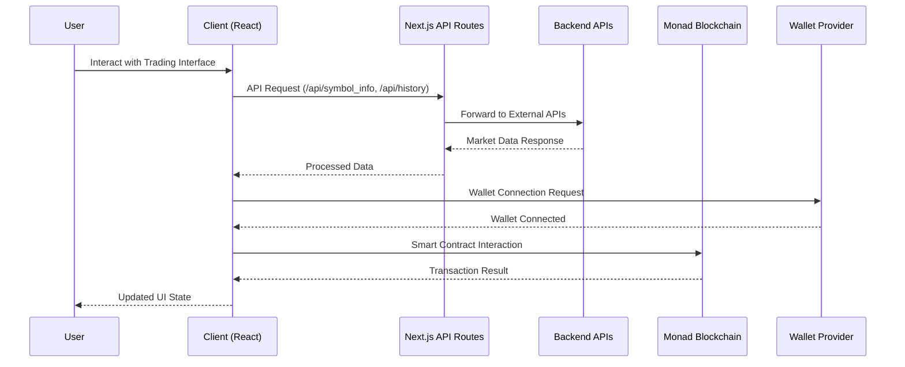
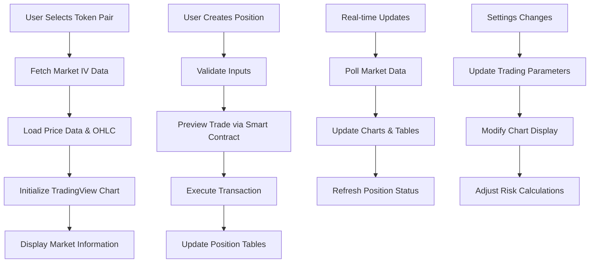

# Timelock Options Trading Frontend

[](https://github.com/your-org/timelock-frontend-monad-v2)
[](https://github.com/your-org/timelock-frontend-monad-v2)
[](LICENSE)
[](https://www.typescriptlang.org/)
[](https://nextjs.org/)
[](https://reactjs.org/)

## Overview

Timelock is a sophisticated options trading frontend application built for the Monad blockchain ecosystem. It provides a comprehensive interface for trading time-locked options with advanced features including real-time market data visualization, position management, and integrated trading execution. The application solves the complex problem of providing institutional-grade options trading capabilities in a decentralized, user-friendly interface while maintaining high performance and security standards.

## Core Features

- **Advanced Options Trading Interface**: Long/short position creation with customizable parameters and risk management tools
- **Real-time Market Data & Charts**: Integrated TradingView charts with live price feeds and implied volatility data
- **Position Management**: Comprehensive tables for tracking active positions, P&L, and the risk metrics
- **Blockchain Integration**: Seamless connection to Monad testnet with wallet integration via ConnectKit
- **Responsive Trading Panel**: Dynamic trading forms with settings customization and trade preview capabilities

## Architecture Overview

This is a modern, client-side rendered React application built with Next.js 15, featuring a component-based architecture with state management through Zustand and React Query. The application integrates with blockchain networks through Viem/Wagmi, provides real-time data visualization via TradingView charts, and maintains a responsive, dark-themed UI built with Tailwind CSS and Radix UI components.

### Request/Response Lifecycle



### Core Data Flow



## Tech Stack

### Frontend
- **Framework**: Next.js 15.2.2 (React 19.0.0)
- **Language**: TypeScript 5.0
- **Styling**: Tailwind CSS 4.0, Tailwind CSS Animate
- **UI Components**: Radix UI (Dialog, Tabs, Popover, Accordion)
- **State Management**: Zustand 5.0.3, React Query 5.67.3
- **Forms**: TanStack React Form 1.0.5
- **Tables**: TanStack React Table 8.21.2
- **Charts**: Recharts 2.15.1, TradingView Charting Library
- **Animations**: Motion 12.5.0

### Blockchain & Web3
- **Wallet Integration**: ConnectKit 1.8.2, Wagmi 2.14.13
- **Blockchain Interaction**: Viem
- **Chain Support**: Monad Testnet (Chain ID: 10143)
- **Smart Contracts**: Custom options trading contracts

### Development & Build Tools
- **Package Manager**: npm/yarn
- **Linting**: ESLint 9.0, Next.js ESLint Config
- **PostCSS**: Tailwind CSS PostCSS 4.0
- **Type Checking**: TypeScript 5.0

## Getting Started - Developer Onboarding

### Prerequisites

- **Node.js**: `v18.x` or higher (LTS recommended)
- **Package Manager**: `npm` `v9.x` or `yarn` `v1.22.x`
- **Git**: `v2.30.x` or higher
- **Browser**: Modern browser with Web3 wallet support (MetaMask, etc.)

### Installation

```bash
# Clone the repository
git clone https://github.com/your-org/timelock-frontend-monad-v2.git
cd timelock-frontend-monad-v2

# Install dependencies
npm install
# or
yarn install
```

### Configuration

Create a `.env.local` file in the root directory with the following environment variables:

```bash
# Blockchain Configuration
NEXT_PUBLIC_TRADE_PREVIEW_ADDRESS=0x948bb501CD7894fC62a98b763d31425eE18041F5
NEXT_PUBLIC_LIQUIDITY_HANDLER_ADDRESS=0x3D2B3BaCCb4C7450B545D291a183AE4011D92A4f
NEXT_PUBLIC_OPTION_MARKET_ADDRESS=0x9f7E675B6176b5182e5e2FEf77EA9724530c7a78

# API Endpoints
NEXT_PUBLIC_API_URL=https://your-api-endpoint.com
NEXT_PUBLIC_OHLC_BACKEND=https://your-ohlc-api.com

# RPC Configuration
NEXT_PUBLIC_RPC_URL=https://testnet-rpc.monad.xyz

# Optional: Development Overrides
NEXT_PUBLIC_CHAIN_ID=10143
NEXT_PUBLIC_BLOCK_EXPLORER=https://testnet-rpc.monad.xyz
```

**Environment Variables Explained:**
- `NEXT_PUBLIC_TRADE_PREVIEW_ADDRESS`: Smart contract address for trade preview functionality
- `NEXT_PUBLIC_LIQUIDITY_HANDLER_ADDRESS`: Contract address for liquidity management
- `NEXT_PUBLIC_OPTION_MARKET_ADDRESS`: Main options market contract address
- `NEXT_PUBLIC_API_URL`: Backend API endpoint for market data
- `NEXT_PUBLIC_OHLC_BACKEND`: API endpoint for price and OHLC data
- `NEXT_PUBLIC_RPC_URL`: Monad testnet RPC endpoint

### Running the Application

```bash
# Start development server
npm run dev
# or
yarn dev

# The application will be available at http://localhost:3000
```

### Running Tests

```bash
# Run linting
npm run lint
# or
yarn lint

# Note: Test suite setup is in progress
# npm test
# yarn test
```

## Project Structure

```
src/
├── app/                    # Next.js 15 app router pages and API routes
│   ├── api/               # Backend API endpoints
│   ├── layout.tsx         # Root layout component
│   └── page.tsx           # Main application page
├── components/            # Reusable React components
│   ├── dialog/           # Modal dialogs (CreatePosition, Faucet)
│   ├── graph/            # Charting components (TradingView integration)
│   ├── navbar/           # Navigation and wallet connection
│   ├── tables/           # Data table components
│   ├── trading-panel/    # Trading interface components
│   └── ui/               # Base UI components (Radix UI wrappers)
├── context/              # React context providers
├── hooks/                # Custom React hooks
├── icons/                # SVG icon components
├── lib/                  # Utility libraries and configurations
│   ├── abis/            # Smart contract ABIs
│   ├── chains.ts        # Blockchain configuration
│   ├── contracts.ts     # Contract addresses
│   └── api.ts           # API client functions
├── providers/            # Application providers (React Query, etc.)
└── stores/               # Zustand state stores
```

## Contribution Guidelines

### Development Workflow

1. **Fork the repository** and create a feature branch from `main`
2. **Create a feature branch**: `git checkout -b feature/your-feature-name`
3. **Make your changes** following the established coding patterns
4. **Test thoroughly** with the development environment
5. **Submit a Pull Request** with a clear description of changes

### Coding Standards

- **TypeScript**: Strict mode enabled, proper type annotations required
- **React**: Functional components with hooks, proper prop typing
- **Styling**: Tailwind CSS classes, consistent spacing and colors
- **State Management**: Use Zustand for global state, React Query for server state
- **Performance**: Implement proper memoization and avoid unnecessary re-renders

### Commit Message Format

We follow [Conventional Commits](https://www.conventionalcommits.org/) format:

```
type(scope): description

feat(trading): add position size calculator
fix(charts): resolve TradingView chart rendering issue
docs(readme): update installation instructions
refactor(api): simplify market data fetching logic
```

**Types**: `feat`, `fix`, `docs`, `style`, `refactor`, `test`, `chore`

## License

Distributed under the MIT License. See the `LICENSE` file for details.

---

**Note**: This application is currently configured for Monad testnet. For production deployment, ensure all environment variables are properly configured for the target network and that all smart contract addresses are verified.
