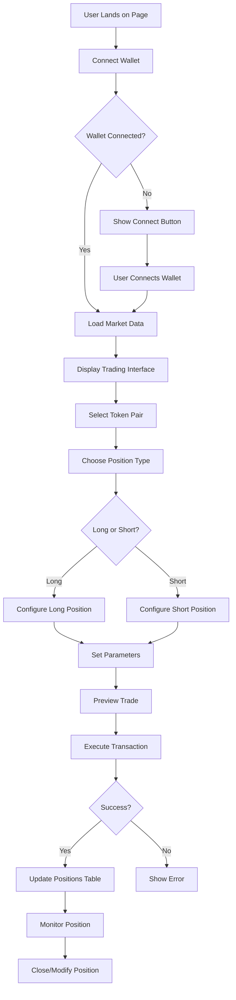

# 🕒 Timelock - DeFi Options Trading Platform

A modern, decentralized options trading platform built on the Monad blockchain, featuring advanced trading tools, real-time market data, and a sophisticated user interface.

## 🎯 What It Does

Timelock is a comprehensive DeFi options trading platform that allows users to:

- **Trade Options**: Execute long/short positions with customizable parameters
- **View Market Data**: Real-time price charts, implied volatility data, and market analytics
- **Manage Positions**: Track and manage active trading positions
- **Access Faucet**: Get testnet tokens for development and testing
- **Connect Wallets**: Seamless Web3 wallet integration for blockchain interactions

## 🏗️ Architecture Overview

```
┌─────────────────────────────────────────────────────────────────┐
│                        Frontend Layer                          │
├─────────────────────────────────────────────────────────────────┤
│  Next.js 15 + React 19 + TypeScript + Tailwind CSS            │
│  ┌─────────────┐ ┌─────────────┐ ┌─────────────┐             │
│  │   Trading   │ │   Charts    │ │  Positions  │             │
│  │    Panel    │ │  (Trading   │ │   Table     │             │
│  │             │ │    View)    │ │             │             │
│  └─────────────┘ └─────────────┘ └─────────────┘             │
└─────────────────────────────────────────────────────────────────┘
                                │
                                ▼
┌─────────────────────────────────────────────────────────────────┐
│                      State Management                          │
├─────────────────────────────────────────────────────────────────┤
│  Zustand (Settings) + React Query (Data) + Context (Market)   │
└─────────────────────────────────────────────────────────────────┘
                                │
                                ▼
┌─────────────────────────────────────────────────────────────────┐
│                      Blockchain Layer                          │
├─────────────────────────────────────────────────────────────────┤
│  Wagmi + Viem + ConnectKit + Monad Testnet                    │
│  ┌─────────────┐ ┌─────────────┐ ┌─────────────┐             │
│  │   Contract  │ │   Wallet    │ │   Chain     │             │
│  │  Execution  │ │  Connection │ │  Management │             │
│  └─────────────┘ └─────────────┘ └─────────────┘             │
└─────────────────────────────────────────────────────────────────┘
                                │
                                ▼
┌─────────────────────────────────────────────────────────────────┐
│                        Backend APIs                            │
├─────────────────────────────────────────────────────────────────┤
│  Market Data + Price Feeds + Position History                 │
└─────────────────────────────────────────────────────────────────┘
```

## 🔄 Application Flow



## 🛠️ Tech Stack

### Frontend Framework
- **Next.js 15** - React framework with App Router
- **React 19** - Latest React with concurrent features
- **TypeScript** - Type-safe development
- **Tailwind CSS 4** - Utility-first CSS framework

### UI Components
- **Radix UI** - Accessible component primitives
- **Lucide React** - Beautiful icons
- **Motion** - Animation library
- **Recharts** - Charting library
- **TradingView** - Professional trading charts

### State Management
- **Zustand** - Lightweight state management
- **React Query** - Server state management
- **React Context** - Component state sharing

### Web3 Integration
- **Wagmi** - React hooks for Ethereum
- **Viem** - TypeScript interface for Ethereum
- **ConnectKit** - Wallet connection UI
- **Big.js** - Decimal arithmetic

### Data & Tables
- **TanStack Table** - Powerful table components
- **TanStack Form** - Form management
- **React Scan** - Development debugging

## 🚀 Getting Started

### Prerequisites
- Node.js 18+ 
- Yarn or npm
- Monad testnet wallet (MetaMask, etc.)

### Installation

```bash
# Clone the repository
git clone <repository-url>
cd timelock-frontend-monad-v2

# Install dependencies
yarn install

# Set up environment variables
cp .env.example .env.local
```

### Environment Variables

```bash
# Required
NEXT_PUBLIC_API_URL=your_api_url
NEXT_PUBLIC_OHLC_BACKEND=your_ohlc_backend
NEXT_PUBLIC_OPTION_MARKET_ADDRESS=0x...

# Optional (with defaults)
NEXT_PUBLIC_TRADE_PREVIEW_ADDRESS=0x...
NEXT_PUBLIC_LIQUIDITY_HANDLER_ADDRESS=0x...
```

### Development

```bash
# Start development server
yarn dev

# Build for production
yarn build

# Start production server
yarn start

# Run linting
yarn lint
```

## 📁 Project Structure

```
src/
├── app/                    # Next.js App Router
│   ├── api/               # API routes
│   │   ├── config/        # Configuration endpoints
│   │   ├── faucet/        # Faucet functionality
│   │   ├── history/       # Trading history
│   │   └── symbol_info/   # Token information
│   ├── layout.tsx         # Root layout
│   └── page.tsx           # Home page
├── components/             # React components
│   ├── dialog/            # Modal dialogs
│   ├── graph/             # Charting components
│   ├── navbar/            # Navigation
│   ├── tables/            # Data tables
│   ├── trading-panel/     # Trading interface
│   └── ui/                # Base UI components
├── context/               # React contexts
├── hooks/                 # Custom React hooks
├── icons/                 # Icon components
├── lib/                   # Utility libraries
│   ├── abis/             # Contract ABIs
│   ├── contracts.ts      # Contract addresses
│   ├── chains.ts         # Blockchain configuration
│   └── api.ts            # API functions
├── providers/             # App providers
└── stores/                # State stores
```

## 🔗 API Endpoints

### Market Data
- `GET /api/get-market/{address}` - Fetch market implied volatility data
- `POST /api/prices` - Get OHLC price data

### Trading
- `POST /api/trade-preview` - Preview trade execution
- `POST /api/trade-execute` - Execute trade transaction

### Configuration
- `GET /api/config` - Application configuration
- `GET /api/symbol_info` - Token pair information

## 🎨 Key Features

### 1. Trading Panel
- **Long/Short Positions**: Toggle between bullish and bearish strategies
- **Parameter Configuration**: Set strike price, expiration, and size
- **Real-time Preview**: See position details before execution
- **Settings**: Customize trading preferences

### 2. Advanced Charting
- **TradingView Integration**: Professional-grade charts
- **Multiple Timeframes**: 1m to 1D intervals
- **Technical Indicators**: Built-in analysis tools
- **Dark Theme**: Optimized for trading

### 3. Position Management
- **Real-time Updates**: Live position tracking
- **Performance Metrics**: P&L, ROI calculations
- **Action Buttons**: Close, modify positions
- **History**: Complete trading record

### 4. Wallet Integration
- **Multi-wallet Support**: MetaMask, WalletConnect, etc.
- **Chain Management**: Monad testnet integration
- **Transaction Handling**: Gas estimation and execution
- **Error Handling**: User-friendly error messages

## 🔧 Configuration

### Blockchain Settings
```typescript
// src/lib/chains.ts
export const monad = {
  chainId: 10143,
  rpcUrls: { default: { http: [RPC_URL] } },
  blockExplorers: {
    default: {
      name: "MonadScan",
      url: "https://testnet-rpc.monad.xyz"
    }
  }
};
```

### Contract Addresses
```typescript
// src/lib/contracts.ts
export const TRADE_PREVIEW_ADDRESS = "0x...";
export const LIQUIDITY_HANDLER_ADDRESS_USDC = "0x...";
```

## 🧪 Testing

### Faucet Access
- **Testnet Tokens**: Get ETH for gas and USDC for trading
- **Development Support**: Easy access for testing features
- **Wallet Integration**: Seamless token distribution

### Test Scenarios
- Wallet connection flows
- Trade execution paths
- Error handling cases
- Responsive design testing

## 🚀 Deployment

### Build Process
```bash
# Create production build
yarn build

# Start production server
yarn start
```

### Environment Setup
- Configure production API endpoints
- Set up monitoring and analytics
- Configure CDN for static assets
- Set up SSL certificates

## 🤝 Contributing

1. Fork the repository
2. Create a feature branch
3. Make your changes
4. Add tests if applicable
5. Submit a pull request

### Development Guidelines
- Follow TypeScript best practices
- Use conventional commit messages
- Maintain component documentation
- Test wallet integration thoroughly

## 📊 Performance

### Optimization Features
- **Code Splitting**: Dynamic imports for better loading
- **Image Optimization**: Next.js image optimization
- **Bundle Analysis**: Webpack bundle analyzer
- **Lazy Loading**: Component lazy loading

### Monitoring
- **Error Tracking**: Sentry integration ready
- **Performance Metrics**: Core Web Vitals
- **Analytics**: User behavior tracking

## 🔒 Security

### Best Practices
- **Environment Variables**: Secure configuration management
- **Input Validation**: Client and server-side validation
- **Wallet Security**: Secure wallet connection handling
- **Transaction Signing**: Proper signature verification

## 📱 Responsive Design

### Breakpoints
- **Mobile**: 320px - 768px
- **Tablet**: 768px - 1024px
- **Desktop**: 1024px+

### Mobile Features
- Touch-friendly trading interface
- Optimized chart interactions
- Responsive table layouts
- Mobile-first navigation

### Getting Help
- **Documentation**: Check this README first
- **Issues**: GitHub issue tracker
- **Discord**: Community support channel
- **Email**: Technical support contact

### Common Issues
- Wallet connection problems
- Transaction failures
- Chart loading issues
- Performance optimization

## 📄 License

This project is licensed under the MIT License - see the [LICENSE](LICENSE) file for details.

## 🙏 Acknowledgments

- **Monad Team**: Blockchain infrastructure
- **TradingView**: Charting library
- **Open Source Community**: Dependencies and tools
- **Contributors**: Code contributions and feedback

---

**Built with ❤️ for the DeFi community**
